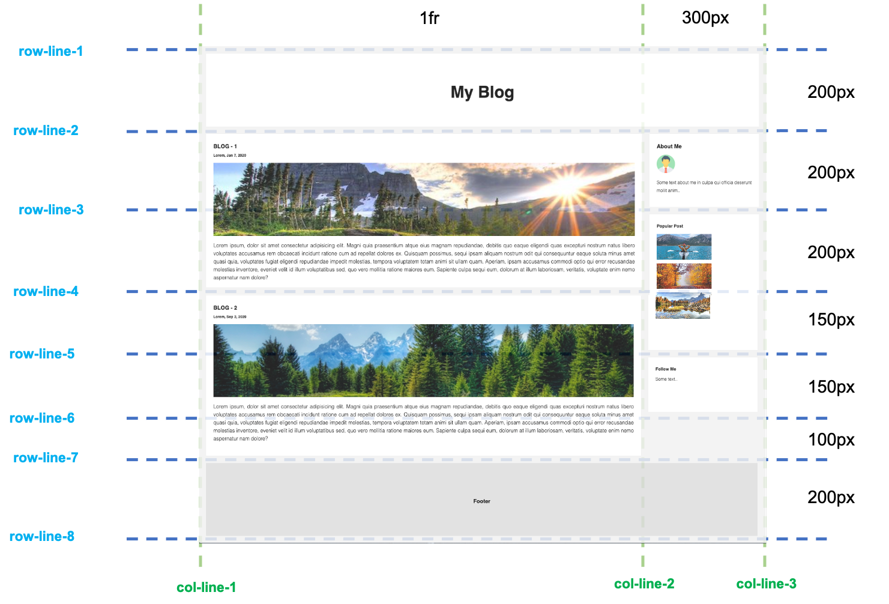

# Grid Blogger

Mit deinen CSS-Grid-Fähigkeiten, erstelle die Blogseite gemäß dem Referenzbild unten

## Anforderungen
- Verwende die Bilder aus dem mitgelieferten **`images` Verzeichnis**
- Verwende den Textinhalt aus der mitgelieferten **`content.txt` Datei**
- Versuche das Layout so genau wie möglich pixelgenau zu treffen

## Layoutentwurf

- Als Bonus kannst du die Seite vollständig responsive machen

## Die Online-Version

Um die Live-Version zu sehen, einfach [klicken...!](https://hsnakk.github.io/UIB_Layout_Grid_Exercise-2/)